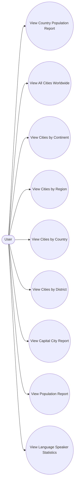

# Use Cases

## Actors

The main actor for the system is:

- **User**

The user interacts with the application to request population, city, capital city and language reports and view the results.

## Main Use Cases

- UC01 - View Country Population Report
- UC02 - View All Cities Worldwide
- UC03 - View Cities by Continent
- UC04 - View Cities by Region
- UC05 - View Cities by Country
- UC06 - View Cities by District
- UC07 - View Capital City Report
- UC08 - View Population Report
- UC09 - View Language Speaker Statistics

## Use Case Descriptions

### UC01 - View Country Population Report

**Actor:** User

**Preconditions:**
- The application is running.
- The population database is available.

**Main Flow:**
1. The user selects a country population report.
2. The application retrieves country population data from the database.
3. The application sorts the countries by population in descending order.
4. The application displays the results to the user.

**Postconditions:**
- The requested country population information is displayed.

**Alternative Flow:**
- If the database cannot be accessed, the application displays an appropriate error message.

---

### UC02 - View All Cities Worldwide

**Actor:** User

**Preconditions:**
- The application is running.
- The population database is available.

**Main Flow:**
1. The user selects the worldwide city report.
2. The application retrieves all cities from the database.
3. The application retrieves each city's name, country, district and population.
4. The application sorts the cities by population in descending order.
5. The application displays the results to the user.

**Postconditions:**
- All cities worldwide are displayed in population order.

**Alternative Flow:**
- If no city data can be retrieved, the application displays an appropriate message.

---

### UC03 - View Cities by Continent

**Actor:** User

**Preconditions:**
- The application is running.
- The population database is available.

**Main Flow:**
1. The user selects a continent.
2. The application retrieves cities belonging to countries within the selected continent.
3. The application sorts the cities by population in descending order.
4. The application displays the city report.

**Postconditions:**
- Cities within the selected continent are displayed.

**Alternative Flow:**
- If no matching cities are found, the application displays an appropriate message.

---

### UC04 - View Cities by Region

**Actor:** User

**Preconditions:**
- The application is running.
- The population database is available.

**Main Flow:**
1. The user selects a region.
2. The application retrieves cities within the selected region.
3. The application sorts the cities by population in descending order.
4. The application displays the results.

**Postconditions:**
- Cities within the selected region are displayed.

**Alternative Flow:**
- If no matching cities are found, the application displays an appropriate message.

---

### UC05 - View Cities by Country

**Actor:** User

**Preconditions:**
- The application is running.
- The population database is available.

**Main Flow:**
1. The user selects a country.
2. The application retrieves cities within the selected country.
3. The application sorts the cities by population in descending order.
4. The application displays the results.

**Postconditions:**
- Cities within the selected country are displayed.

**Alternative Flow:**
- If no matching cities are found, the application displays an appropriate message.

---

### UC06 - View Cities by District

**Actor:** User

**Preconditions:**
- The application is running.
- The population database is available.

**Main Flow:**
1. The user selects a district.
2. The application retrieves cities within the selected district.
3. The application sorts the cities by population in descending order.
4. The application displays the results.

**Postconditions:**
- Cities within the selected district are displayed.

**Alternative Flow:**
- If no matching cities are found, the application displays an appropriate message.

---

### UC07 - View Capital City Report

**Actor:** User

**Preconditions:**
- The application is running.
- The population database is available.

**Main Flow:**
1. The user selects a capital city report.
2. The application retrieves the required capital city data.
3. The application sorts the capital cities by population in descending order.
4. The application displays the results.

**Postconditions:**
- The requested capital city report is displayed.

**Alternative Flow:**
- If the requested data cannot be retrieved, the application displays an appropriate message.

---

### UC08 - View Population Report

**Actor:** User

**Preconditions:**
- The application is running.
- The population database is available.

**Main Flow:**
1. The user selects a population report.
2. The application retrieves the required population data.
3. The application processes the results.
4. The application displays the population information to the user.

**Postconditions:**
- The requested population report is displayed.

**Alternative Flow:**
- If the database cannot be accessed, the application displays an appropriate error message.

---

### UC09 - View Language Speaker Statistics

**Actor:** User

**Preconditions:**
- The application is running.
- The population database is available.

**Main Flow:**
1. The user selects a language statistics report.
2. The application retrieves the required language information.
3. The application calculates the number of people who speak the language.
4. The application calculates the percentage of the world's population who speak the language.
5. The application displays the language, number of speakers and percentage.

**Postconditions:**
- The requested language statistics are displayed.

**Alternative Flow:**
- If the language information cannot be retrieved, the application displays an appropriate error message.

## Use Case Diagram

